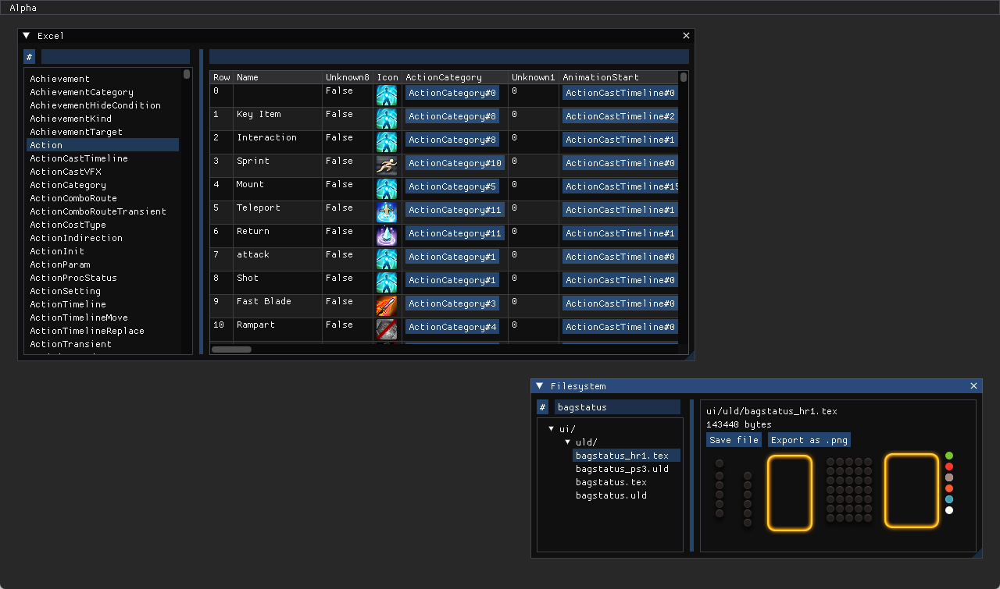

# Alpha

Alpha is a FINAL FANTASY XIV toolkit for modding, datamining, and reverse engineering.

## Features

- Excel sheet browser
  - Support for Excel definitions through [EXDSchema](https://github.com/xivdev/EXDSchema) and [SaintCoinach](https://github.com/xivapi/SaintCoinach)
  - View multiple sheets at once, even from different game installs
  - Inline images, sheet links, and tooltips
  - Advanced filtering with C# scripting and full text search
- SqPack filesystem browser
  - Support for path lists from [ResLogger](https://rl2.perchbird.dev/), as well as custom lists
  - View and export files with unknown paths
  - Preview game textures without extracting them
  - Export files individually or in bulk

## Downloads

[Available on GitHub Releases](https://github.com/NotNite/Alpha/releases). You will need [the .NET 9 Runtime](https://dotnet.microsoft.com/en-us/download). See [the manual](MANUAL.md) for using Alpha.

## TODO

- Improve performance (with rendering, memory allocations, really everything)
- Saving Excel schemas to disk & multiple schemas for different game versions
