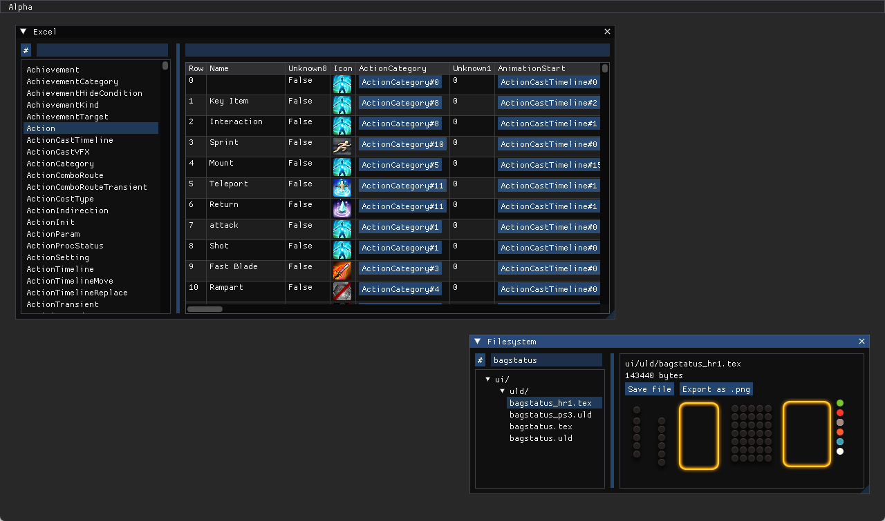

# Alpha

Alpha is a FINAL FANTASY XIV toolkit for modding, datamining, and reverse engineering.

## Features

- Excel sheet browser
  - Support for Excel definitions through [EXDSchema](https://github.com/xivdev/EXDSchema) and [SaintCoinach](https://github.com/xivapi/SaintCoinach)
  - View multiple sheets at once, even from different game installs
  - Inline images, sheet links, and tooltips
  - Advanced filtering with C# scripting and full text search
- SqPack filesystem browser
  - Support for path lists from [ResLogger](https://rl2.perchbird.dev/), as well as custom lists
  - View and export files with unknown paths
  - Preview game textures without extracting them
  - Export files individually or in bulk

## Downloads

  
  
(that's not a virus that's just to grab your attention)

---

For using Alpha, check out [the manual](MANUAL.md).

- Windows users can download [AlphaAOT.zip](https://github.com/NotNite/Alpha/releases/latest/download/AlphaAOT.zip). This is a build of Alpha using [NativeAOT](https://learn.microsoft.com/en-us/dotnet/core/deploying/native-aot/), which means you don't need the .NET Runtime installed. (This is also what that green button links to.)
- Other users with the [.NET runtime](https://dotnet.microsoft.com/en-us/download) installed can download [Alpha.zip](https://github.com/NotNite/Alpha/releases/latest/download/Alpha.zip). This build has some extra features (like Excel filter scripting), comes with debug symbols & better stack traces, and (theoretically) works on Linux and macOS.
- Older versions are available [on the Releases tab](https://github.com/NotNite/Alpha/releases). Unstable builds are available [on the Actions tab](https://github.com/NotNite/Alpha/actions/workflows/nightly.yml). Unstable builds expire after a while and require being signed into GitHub (or using a third party service like [nightly.link](https://nightly.link/)).

## TODO

- Improve performance (with rendering, memory allocations, really everything)
- Saving Excel schemas to disk & multiple schemas for different game versions
